# Micro-Swimmer Control using Deep Reinforcement Learning
This project uses a Deep Reinforcement Learning algorithm (TD3) to control a microswimmer moving under stochastic dynamics and background flows.
## 🧮 Physical Model and Dynamics : 

The hyperparameters used in this project are as follows : 

### 1. **Stochastic Dynamics** :
<div align="center">
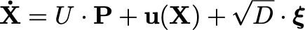
</div>


- $U = 1$: Speed magnitude  
- $\mathbf{P}$: Direction (action predicted by the agent)  
- $\mathbf{u}(\mathbf{X})$: Background velocity  
- $D$: Diffusion coefficient  
- $\boldsymbol{\xi} \sim \mathcal{N}(0, 1)$ : Gaussian white noise 

### 2. **Numerical Integration** : 
We simulate the dynamics using an Euler–Maruyama scheme:
<div align="center">
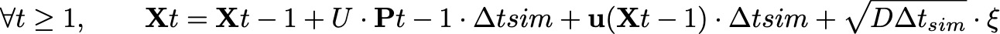
</div>

* The time between each action is chosen to be able to follow a certain curvature : $\Delta t_{a} = \frac{1}{\kappa \cdot U}$ and the simulation time step is derived as : $\Delta t_{sim} = 5 \cdot \Delta t_{a}$
* $a$ is the accuracy wanted, thus the threshold is $\delta = a\cdot L$. With L the typical lenght of the path.
* $D \ll \frac{\delta^2}{\Delta t_a}$
* $\mathbf{P}$ is predicted by the agent. 
  

### 3. **TD3** : 
* Batch size :  256
* Discount factor $\gamma$ : 1 
* Target update rate $\tau$ : 0.005
* Policy update frequency : 5

## 🤖 Reinforcement Learning : 

<p align="center"><i>Figure 1</i></p>

### State Space

- $\mathbf{X}$ : Position in local frame (w.r.t. the closest path point)
- $\mathbf{V}$ : Velocity in local frame (optional)
- Lookahead: List of $n$ future points along the path
  
### Action

- Direction $\mathbf{P}$ (2D vector of unit norm)

### Reward Function

$$
r_t = -C \cdot \Delta t_{\text{sim}} - \|x_t - x_{\text{target}}\| + \|x_{t-1} - x_{\text{target}}\| - \beta \cdot d
$$

Where:

- $x_{\text{target}}$ : Target position  
- $d$ : Distance to closest point on the path  
- $C \ (m.s^{-1}), \beta$ : Constant weights


## 🏊‍♂️ Training Protocol
### Episode ending conditions
- Agent reaches target within threshold $\delta$
- Episode time exceeds $t_{\text{max}}$
### Background Flow Configurations
To enhance robustness, training can include different types of background flows:
  * **Uniform background flow** : $\forall X, \quad \mathbf{u}(\mathbf{X}) = \mathbf{v}$
  * **Rankine vortex** : The velocity components  $(v_r, v_\theta, v_z)$
    f the Rankine vortex, expressed in terms of the cylindrical coordinate system 
    $(r, \theta, z)$, 
    are given by :
    <div align="center">
    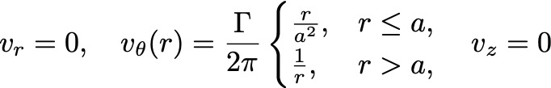
    </div>


### Path Variants 
- Straight line  
- Semi-circle  
- Sinusoidal (undulating) path  
- Curves with varying curvature
<div align="center">

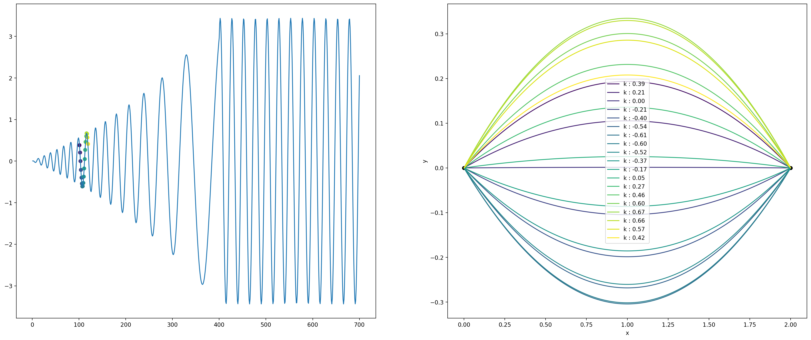

<i>Figure 2 — Left : curvature of the curve along epsiode. Right : Example of curve between episode 100 and 120</i>
</div>

### Random background flow parameters
The parameters of the background flow are randomly sampled at the beginning of each episode as follows:

- **Uniform flow**:
  - Direction vector $\,\mathbf{d} \in \mathbb{R}^2\,$ is sampled uniformly:
    $\mathbf{d} \sim \mathcal{U}([-1,1]^2)$ and normalized
  - Norm of the velocity:
    $\|\mathbf{u}\| \sim \mathcal{U}(0, 0.6)$

- **Rankine vortex**:
  - Center of the vortex $\,\mathbf{c} = (x_c, y_c)\,$ is sampled as: $x_c \sim \mathcal{U}(0, 2), \quad y_c \sim \mathcal{U}(0, 1)$
  - Core radius: $a \sim \mathcal{U}(0, 1)$
  - Circulation (positive or negative): $\Gamma \sim \mathcal{U}(-1, 1)$

The function `random_bg_parameters()` returns these five values:
```python
def random_bg_parameters():
    dir = np.random.uniform(-1, 1, 2)
    dir = dir / np.linalg.norm(dir)
    norm = np.random.rand() * 0.6

    a = np.random.rand()
    center = [np.random.rand() * 2, np.random.rand()]
    cir = (np.random.rand() - 0.5) * 2
    return dir, norm, center, a, cir
```
## ⏱️ Agent Evaluation :
After training, agents are evaluated on a variety of path types and background flow configurations to assess their generalization ability and robustness. 
### Path types : 
Agents are evaluated on the following five types of target paths:
* line: a straight line.
* curve_minus: a negatively curved path.
*	curve_plus: a positively curved path.
*	ondulating: a sinusoidal path.
*	circle: a circular trajectory.
### Background Flow Configurations

Three types of background flow are considered during evaluation:

1. **Uniform Background Flow**  
   The agent swims in a constant flow with different directions:
   - `east_05`: vector $(1, 0)$
   - `west_05`: vector $(-1, 0)$
   - `north_05`: vector $(0, 1)$
   - `south_05`: vector $(0, -1)$

   Each direction is tested with a flow norm of $0.5$.

2. **No Background Flow**  
   The environment is evaluated without any background flow (`free` configuration).

3. **Rankine Vortex**  
   The agent is evaluated in a rotational background flow with a Rankine vortex defined by:
   - circulation intensity: $cir = 2$
   - vortex core strength: $a = 0.5$
   - vortex center: $(1, \frac{3}{4})$
  
The results are saved in JSON format and ranked using: 
```python
rank_agents_by_rewards(results)
```
## 📉 Preliminary result 
### Velocity in the state
<div align="center">
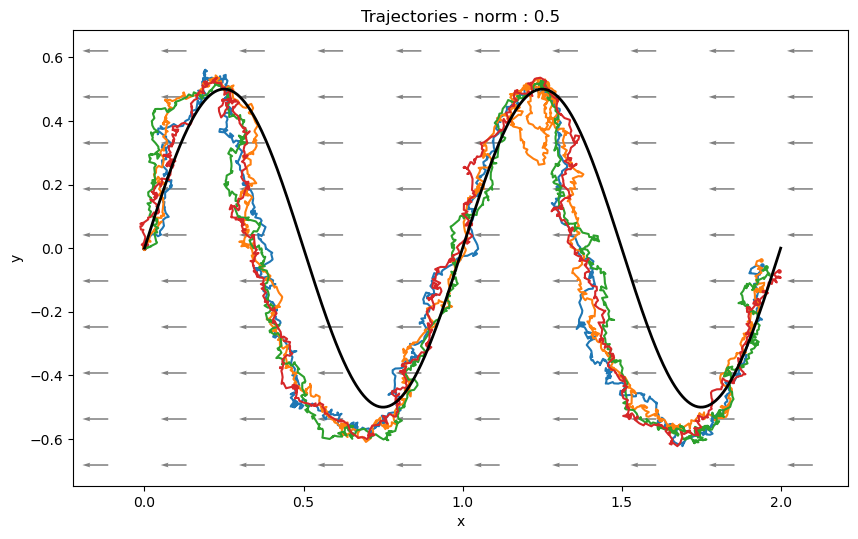
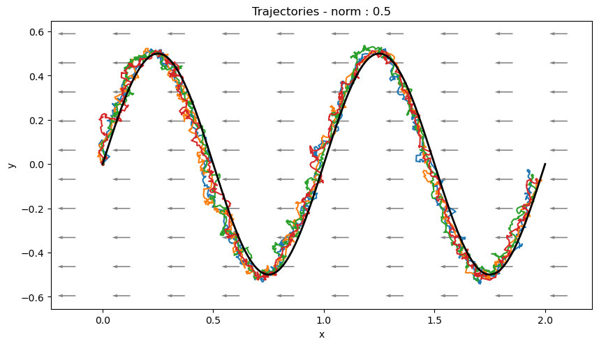
</div>

<p align="center"><i>Figure 3 — Left : Velocity not includes in the state. Right : Velocity includes in the state.</i></p>

**Comments on the inclusion of velocity in the state** :
Adding velocity to state representation increase the robustness to varying background flow as shown in the illustrating example of the Figure 3. 

---

### Comparison of training types
With velocity includes in the state : 
<div align="center">
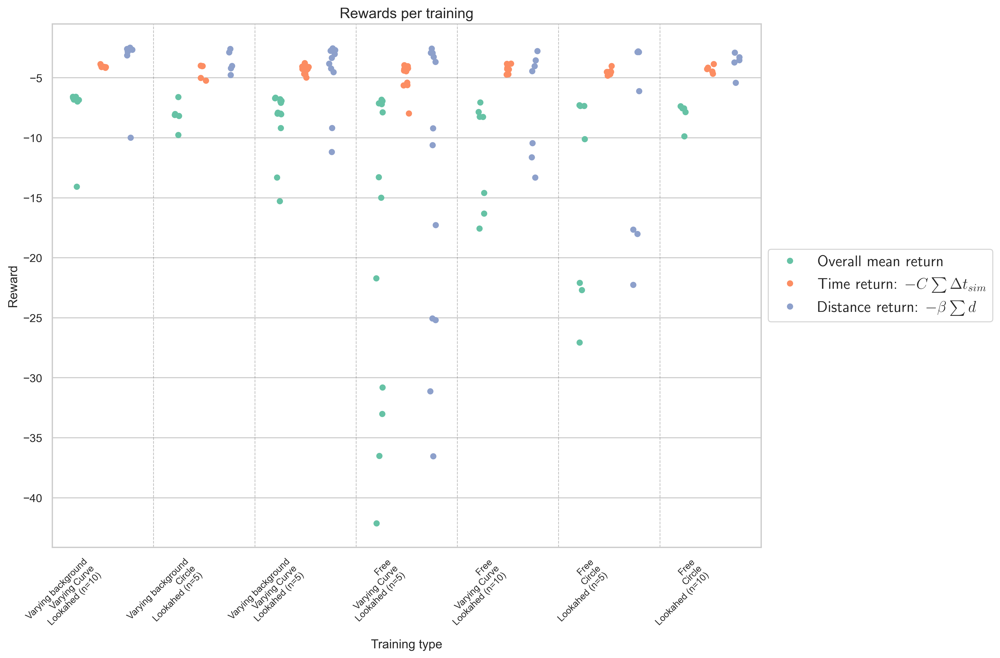
<i>Figure 4</i>
</div>

Figure 4 shows the mean return across all configurations depicted above (30 different scenarios). Each point corresponds to the mean return of an agent trained with training parameters on the x-axis. 
  
  * First parameter :
    * Varying background : Uniform background flow or rankine vortex.
    * Free : No background flow
  * Second parameter : 
    * Varying curve : One of the path variant (see figure 2)
    * Circle : Agent trained on a fixed circle
  * Third parameter :
    * Number of points in the state corresponding to the number of points in the lookahead.
 
---

### Best agent 
| Reward                 | Varying Background | Path          | Lookahed (n)| Name         |
|------------------------|--------------------|---------------|-------------|--------------|
| -6.584                 |  True              | Varying Curve | 10          | 04-18_13-33  |
| -6.585                 |  True              | Varying Curve | 10          | 04-18_12-51  |                                                            
| -6.606                 |  True              | Circle        | 5           | 04-15_14-19  |                                                                
| -6.659                 |  True              | Varying Curve | 5           | 04-17_14-27  |                                                                

**Comments on returns** : 
The best agents have very similar returns acorss the different scenarios presented in the evaluation. Increasing the lookahead points and introducing varying background flow appear to stabilize the agents' performance . Using the same path across all episodes does not decrease the performance during the evaluation. 

---

### Streamlines 


Training on **circle**  : 
<p align="center">
  
  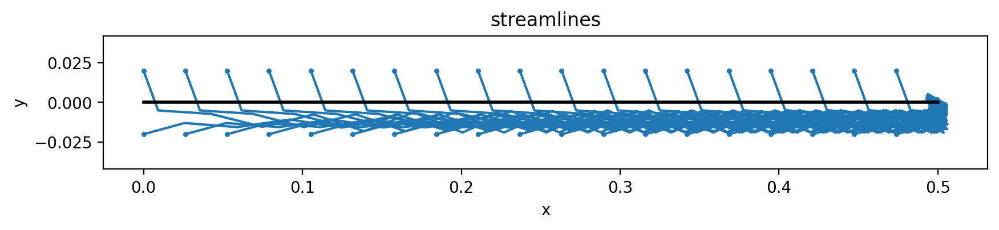
  
</p>

Training on **varying curve** : 
<p align="center">
  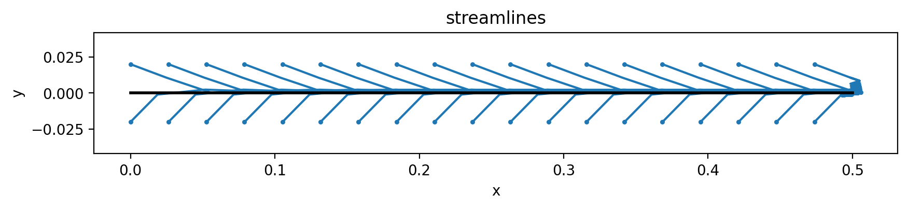
  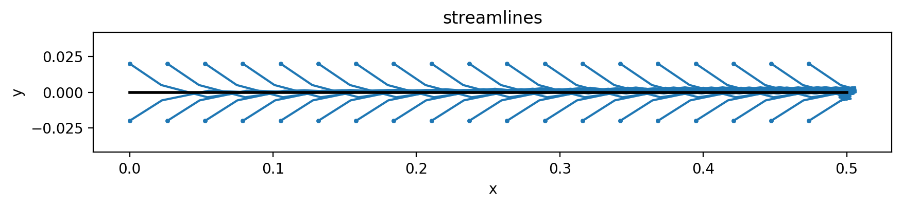
  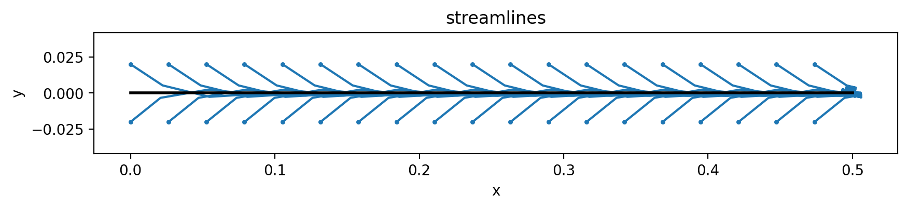
</p>

**Comments on streamlines** : 
Training with non-symmetrical paths introduces a bias in the policy's action, which can be observed when visualizing the streamline across differents starting points along a straight line. 

---

### Increasing $\beta$
Increasing $\beta$ in the reward penalizes actions that lead to larger distances between the agent and the path more heavily. Agents were trained with different values of $\beta$, ranging from 0.05 to 4.

<p align="center">
  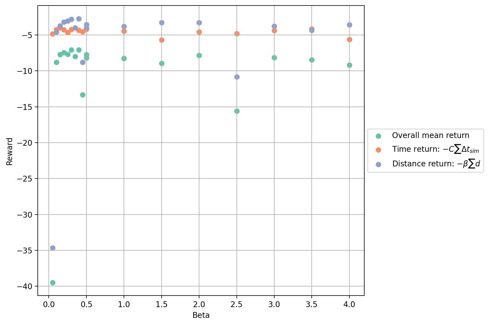
  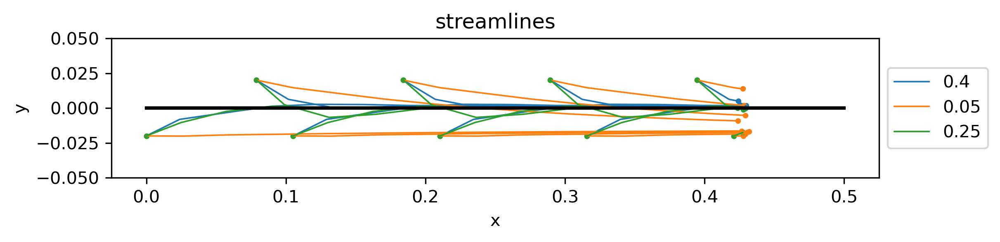
</p>

**Comments** : 
The overall return remains relatively constant with respect to $\beta$. Except for a very low value where the agent fails to follow the path, as a result the return based on the cumulative distance between the agent and the path increases drastically. As expected, the streamlines converge faster toward the path as $\beta$ increases.

## ⚙️ Main configuration parameters

The training and simulation can be customized via a `config` dictionary. Below are key parameters and their roles:

| Parameter              | Type      | Description                                                                 |
|------------------------|-----------|-----------------------------------------------------------------------------|
| `uniform_bg`           | `bool`    | Add a random uniform background flow during training.                       |
| `rankine_bg`           | `bool`    | Add a random Rankine vortex as background flow during training.             |
| `random_curve`         | `bool`    | If `True`, the path used for training is a smooth curve with varying curvature. |
| `Dt_action`            | `float`   | Time between two decisions made by the agent.                               |
| `threshold`            | `float`   | Target threshold distance. Episode ends when this distance is reached.      |
| `D`                    | `float`   | Diffusion coefficient (noise level).                                        |
| `velocity_bool`        | `bool`    | If `True`, includes velocity in the agent's state.                          |
| `n_lookahead`          | `int`     | Number of points ahead along the path given in the observation.             |
| `steps_per_action`     | `int`     | Number of simulation steps between two actions.                             |
| `episode_per_update`   | `int`     | Number of episodes between each actor/critic update.                        |
| `beta`                 | `float`   | Weight for the penalty on the distance to the path in the reward function.  |
| `path`, `tree`         | `object`  | The trajectory to follow, and its spatial index (KD-tree)

---

## 📁 Project structure

All the main scripts are located in the `src/` folder. Here's an overview:

| File                         | Purpose                                                                 |
|------------------------------|-------------------------------------------------------------------------|
| `TD3.py`                     | Implementation of the TD3 algorithm.                                    |
| `env_swimmer.py`             | The custom environment simulating the microswimmer dynamics.            |
| `generate_path.py`           | Generates different kinds of paths: lines, curves, oscillating paths.   |
| `simulation.py`                     | Implements the stochastic differential equation governing the swimmer's motion. |
| `evaluate_agent.py`         | Evaluates a trained agent on various paths.                             |
| `evaluation_after_training.py` | Scripts for visualization and analysis after training.               |
| `rank_agents.py`            | Ranks agents based on performance on multiple paths.                    |
| `plot.py`, `visualize.py`   | Utility scripts for plotting trajectories and training stats.           |                 |
| `analytic_solution_line.py` | Analytical comparison for the case of a straight line path.             |
| `distance_to_path.py`       | Computes closest points and distances to paths.                         |
| `invariant_state.py`        | Transforms the state into an invariant representation.                  |
| `utils.py`                  | Miscellaneous helper functions.                                         |