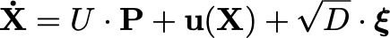
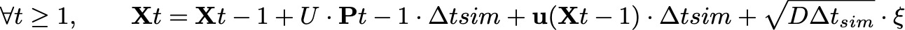
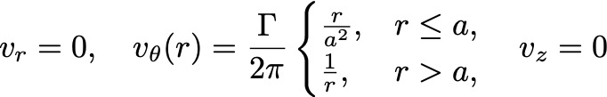
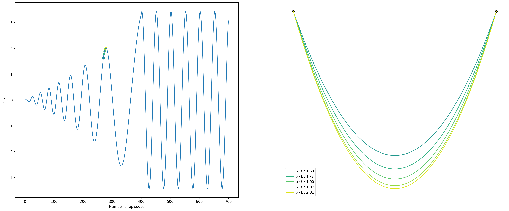

# Micro-Swimmer Control using Deep Reinforcement Learning
This project uses a Deep Reinforcement Learning algorithm (TD3) to control a microswimmer moving under stochastic dynamics and background flows.
## Physical Model and Dynamics : 

The hyperparameters used in this project are as follows : 

### 1. **Stochastic Dynamics** :

- $U = 1$: Speed magnitude  
- $\mathbf{P}$: Direction (action predicted by the agent)  
- $\mathbf{u}(\mathbf{X})$: Background velocity  
- $D$: Diffusion coefficient  
- $\boldsymbol{\xi} \sim \mathcal{N}(0, 1)$ : Gaussian white noise 

### 2. **Numerical Integration** : 
We simulate the dynamics using an Euler–Maruyama scheme:

* The time between each action is chosen to be able to follow a certain curvature : $\Delta t_{a} = \frac{1}{\kappa \cdot U}$ and the simulation time step is derived as : $\Delta t_{sim} = 5 \cdot \Delta t_{a}$
* $a$ is the accuracy wanted, thus the threshold is $\delta = a\cdot L$. With L the typical lenght of the path.
* $D \ll \frac{\delta^2}{\Delta t_a}$
* $\mathbf{P}$ is predicted by the agent. 
  

### 3. **TD3** : 
* Batch size :  256
* Discount factor $\gamma$ : 1 
* Target update rate $\tau$ : 0.005
* Policy update frequency : 5

## Reinforcement Learning : 

### State Space

- $\mathbf{X}$ : Position in local frame (w.r.t. the closest path point)
- $\mathbf{V}$ : Velocity in local frame (optional)
- Lookahead: List of $n$ future points along the path
  
### Action

- Direction $\mathbf{P}$ (2D vector of unit norm)

### Reward Function

$$
r_t = -C \cdot \Delta t_{\text{sim}} - \|x_t - x_{\text{target}}\| + \|x_{t-1} - x_{\text{target}}\| - \beta \cdot d
$$

Where:

- $x_{\text{target}}$ : Target position  
- $d$ : Distance to closest point on the path  
- $C, \beta$ : Constant weights

## Training Protocol
### Epsiode ending conditions
- Agent reaches target within threshold $\delta$
- Episode time exceeds $t_{\text{max}}$
### Background Flow Configurations
To enhance robustness, training can include different types of background flows:
  * **Uniform background flow** : $\forall X, \quad \mathbf{u}(\mathbf{X}) = \mathbf{v}$
  * **Rankine vortex** : The velocity components  $(v_r, v_\theta, v_z)$
    f the Rankine vortex, expressed in terms of the cylindrical coordinate system 
    $(r, \theta, z)$, 
    are given by :
    

    
    

### Path Variants 
- Straight line  
- Semi-circle  
- Sinusoidal (undulating) path  
- Curves with varying curvature  

<i>Figure 1 — Left : curvature of the curve along epsiode. Right : Example of curve between episode 100 and 120</i>

## ⚙️ Main configuration parameters

The training and simulation can be customized via a `config` dictionary. Below are key parameters and their roles:

| Parameter              | Type      | Description                                                                 |
|------------------------|-----------|-----------------------------------------------------------------------------|
| `uniform_bg`           | `bool`    | Add a random uniform background flow during training.                       |
| `rankine_bg`           | `bool`    | Add a random Rankine vortex as background flow during training.             |
| `random_curve`         | `bool`    | If `True`, the path used for training is a smooth curve with varying curvature. |
| `Dt_action`            | `float`   | Time between two decisions made by the agent.                               |
| `threshold`            | `float`   | Target threshold distance. Episode ends when this distance is reached.      |
| `D`                    | `float`   | Diffusion coefficient (noise level).                                        |
| `velocity_bool`        | `bool`    | If `True`, includes velocity in the agent's state.                          |
| `n_lookahead`          | `int`     | Number of points ahead along the path given in the observation.             |
| `steps_per_action`     | `int`     | Number of simulation steps between two actions.                             |
| `episode_per_update`   | `int`     | Number of episodes between each actor/critic update.                        |
| `beta`                 | `float`   | Weight for the penalty on the distance to the path in the reward function.  |
| `path`, `tree`         | `object`  | The trajectory to follow, and its spatial index (KD-tree)

---

## 📁 Project structure

All the main scripts are located in the `src/` folder. Here's an overview:

| File                         | Purpose                                                                 |
|------------------------------|-------------------------------------------------------------------------|
| `TD3.py`                     | Implementation of the TD3 algorithm.                                    |
| `env_swimmer.py`             | The custom environment simulating the microswimmer dynamics.            |
| `generate_path.py`           | Generates different kinds of paths: lines, curves, oscillating paths.   |
| `simulation.py`                     | Implements the stochastic differential equation governing the swimmer's motion. |
| `evaluate_agent.py`         | Evaluates a trained agent on various paths.                             |
| `evaluation_after_training.py` | Scripts for visualization and analysis after training.               |
| `rank_agents.py`            | Ranks agents based on performance on multiple paths.                    |
| `plot.py`, `visualize.py`   | Utility scripts for plotting trajectories and training stats.           |                 |
| `analytic_solution_line.py` | Analytical comparison for the case of a straight line path.             |
| `distance_to_path.py`       | Computes closest points and distances to paths.                         |
| `invariant_state.py`        | Transforms the state into an invariant representation.                  |
| `utils.py`                  | Miscellaneous helper functions.                                         |