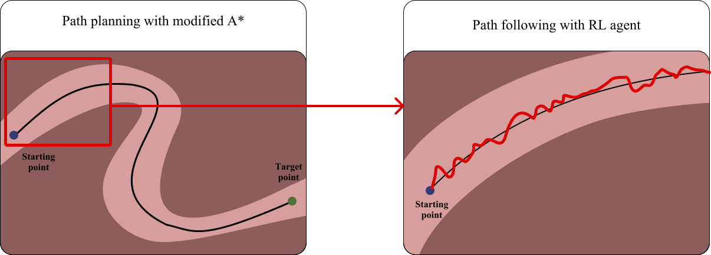
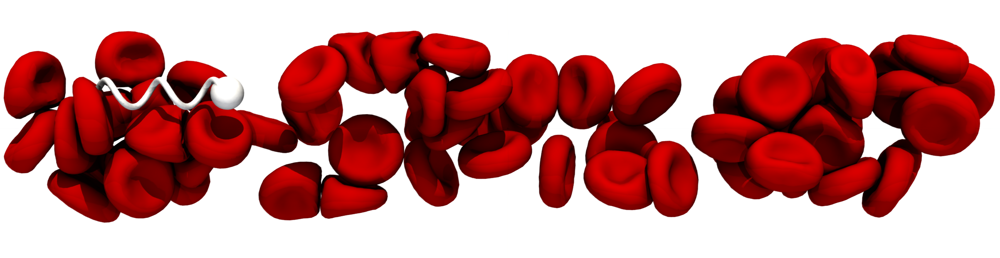
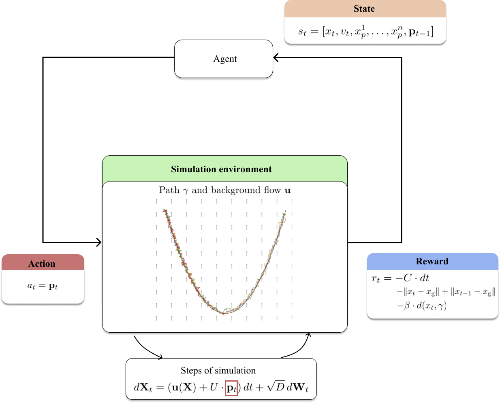

# Micro-Swimmer Control using Deep Reinforcement Learning (Research Internship)
This repository focuses on the **2D training** part of the project.  
The [**3D training**](https://github.com/lauraachoquett/microswimmer_3d_ROM) and evaluation will be available in a separate repository.  
Note that the transfer to high-fidelity simulations with [**Mirheo**](https://github.com/cselab/Mirheo) is not included here.

## Project
The goal of this work is to train a single Reinforcement Learning (RL) agent capable of following arbitrary trajectories between arbitrary start–goal pairs.  
We adopt a two-stage approach:
1.	A flow-aware path-planning module computes feasible trajectories that account for both geometry and background flow.
2.	A RL control policy, trained on local path segments in a reduced-order model, learns to generalize to arbitrary global trajectories.

    
     
    <i>Schematic representation of the path-planning and path-following pipeline.. </i>

The resulting policy is then evaluated in high-fidelity fluid simulations using [**Mirheo**](https://github.com/cselab/Mirheo) and trained with the TD3 algorithm

    
     
    <i>Figure - Illustrative schematic of a microswimmer in a periodic blood-filled tube. </i>

## Reinforcement Learning formulation

### State

- $\mathbf{X}$ : Position in local frame (w.r.t. the closest path point)
- $\mathbf{V}$ : Velocity in local frame (optional)
- $\mathbf{P}$ : Previous action
- Lookahead : List of the positions and velocities (optional) of the n points following the closest point along the path.

Positions and velocities are expressed in the same local frame, whereas the previous action is provided in the last computed local frame.
### Action 

- Direction $\mathbf{P}$ (2D vector of unit norm)

### Reward 

$$
r_t = -C \cdot \Delta t_{\text{sim}} - \|x_t - x_{\text{target}}\| + \|x_{t-1} - x_{\text{target}}\| - \beta \cdot d
$$

Where:

- $x_{\text{target}}$ : Target position  
- $d$ : Distance to closest point on the path  
- $C \ (m.s^{-1}), \beta$ : Constant weights

## Training loop

    
     
    <i>Figure - Illustrative schematic of a microswimmer in a periodic blood-filled tube. </i>

## Results

Navigation from a fixed starting point (orange) to 500 uniformly distributed target points (red) in the capillary network. Each blue line represents a successful trajectory of the RL agent following a path planned by the modified A* algorithm (flow- and wall-aware).

    
     
    <i>Figure - Illustrative schematic of a microswimmer in a periodic blood-filled tube. </i>

